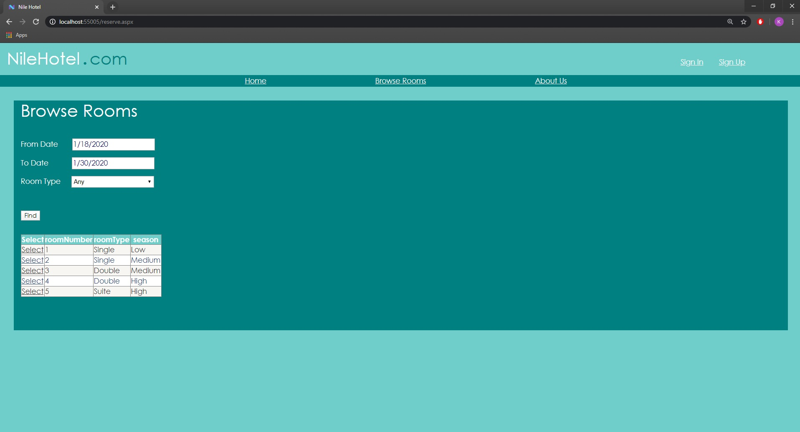

# Nile-Hotel
A secure rich internet application for a hotel to support reservation transactions and services. Based on centralized database and web services. Developed using ASP.net, SQL and Ajax.

Project requirements [file](https://github.com/karimatwa/Nile-Hotel/blob/master/Course%20Project%20requirements%20F17%20(hotel).pdf).

<h1 align="center">Screens</h1>

     

